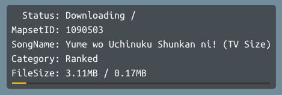
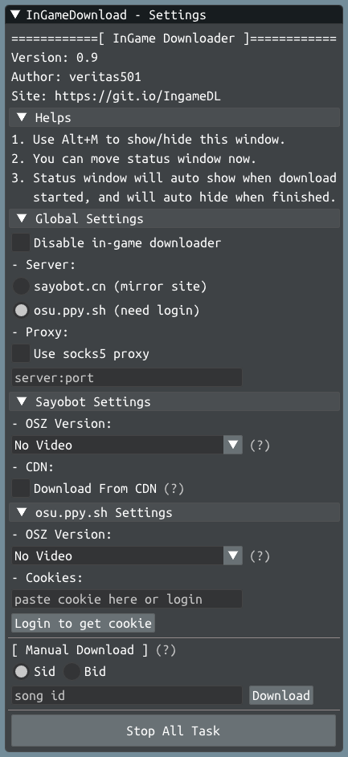

# Osu Ingame Downloader

一个使用Ingame overlay(游戏内叠加渲染)方式实现的Osu游戏内铺面下载器。

铺面镜像使用[Sayobot]( https://osu.sayobot.cn/)，感谢Sayobot提供如此优质的服务。

## 程序界面

- 下载时进度显示：

- 设置窗口：

## 使用说明

本下载器的实现方式和steam中`shift+tab`的overlay以及OsuSync中的[IngameOverlay](https://github.com/OsuSync/IngameOverlay) 是一样的。

只要不涉及游戏数据作弊，Osu!还是比较宽容的。因此，虽然下载器需要注入DLL到Osu!中并修改Osu!的Render以及劫持某些API，但正常使用是不会被Ban的。如果用户使用后因本插件被Ban，作者不承担任何责任。

PS：作为参考，使用OsuSync的IngameOverlay不会被Ban， https://osu.ppy.sh/community/forums/topics/697214?n=78

## 程序下载

 https://github.com/veritas501/Osu-Ingame-Downloader/releases 

## 食用方法

1. 从[下载页](https://github.com/veritas501/Osu-Ingame-Downloader/releases )下载`IngameDL.dll`和`loader.dll`。
2. 将`IngameDL.dll`放入Osu!的游戏目录下，即和`osu!.exe`在同一目录。
3. 从`loader.dll`放入Osu!的游戏目录下，并重命名为以下任意一种方案(为了劫持)：
   1. `xinput1_4.dll`
   2. `winmm.dll`
   3. `bass.dll`，并将目录下原`bass.dll`改名为`bass.dll.dll`
   4. `libEGL.dll`，并将目录下原`libEGL.dll`改名为`libEGL.dll.dll`
4. 启动Osu!，在游戏内按`Alt+M`测试下载器是否启动成功，否则尝试切换方案。
5. 游戏内按`Alt+M`可以唤出设置窗口，此时可以调整偏好选项或停用下载器，且可以自由移动`Status`窗口的位置
6. `Status`窗口平时是隐藏的，只有在有下载任务的时候显示，下载完成后会再次隐藏。
7. 插件会判断铺面是否已经存在，如果存在则不再下载且打开浏览器。

## 功能介绍

1. 游戏内按`Alt+M`可以唤出设置窗口，这也表示下载器已经成功加载，**如果不想过多配置，其实已经可以直接使用了**。下面介绍具体配置。
2. 在唤出设置窗口的同时，可以发现`Status`窗口同时也显示了，此时可以自由移动`Status`窗口至喜欢的位置。
3. Global Settings：全局设置
   1. Disable in-game downloader：停用下载器，如果想暂时不用下载器可以勾选此项。
   2. Server：服务器选择，可以选择sayobot镜像站或者官网下载，需要注意的是官网下载是需要账号登陆才能下载，关于如何登陆会在后面说到。
   3. Proxy：代理，这里只支持socks5代理(不要问我什么事socks5，请自行谷歌)，如果需要让下载走代理则勾选此项并在下面的文本框中填写代理地址，一般是在sayobot抽风时和官网下载配套使用。
4. Sayobot Settings：有关sayobot的设置
   1. OSZ version：铺面下载版本，众所周知，sayobot提供了三种铺面：完整版，无视频版和mini版，这里可以按喜好自行选择。
   2. CDN：是否走CDN线路，一般不选。
5. osu.ppy.sh Settings：官网下载设置
   1. OSZ version：铺面下载版本，官网只提供了两种铺面：完整版和无视频版，按自己喜好选择。
   2. Cookies：这里是登陆后的Cookie，用于下载。同样不要问我什么是Cookie，但切记不要将cookie分享给他人。Cookie一般不需要手动填写，只需点击下面的Login按钮登陆即可。我不会窃取你的账号密码，您可以自由查阅程序源码。
6. Manual Download：手动下载
   1. 可以选择输入Sid或Bid，在下面的输入框输入后点击右边的download按钮下载。
7. Stop All Task：停止所有任务，有的时候下载会卡住，但由于有些实现层的原因，我并不能单独取消单个任务，因此点击这个按钮会停止当前所有的下载任务。

## 演示视频

视频中使用版本较老，具体功能以当前版本为准。

